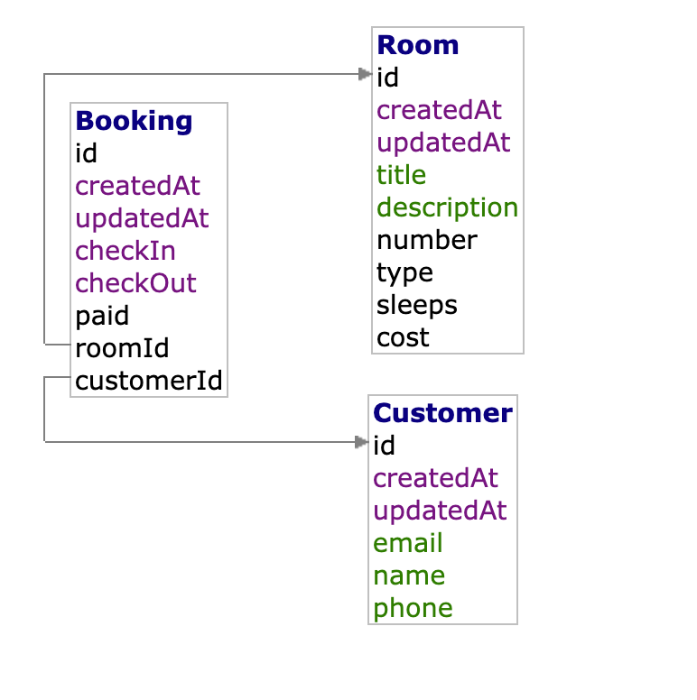

# Room Booking

Room booking backend graphql and front end with database.

### Requirements

- Node version v18.18
- Npm (backend)
- Yarn (frontend)
- Docker

## Backend GraphQL Server

Its using NestJS (code-first). In the code first approach, we use decorators and TypeScript classes to generate the corresponding GraphQL schema.

Used following stack:

- [NestJS](https://docs.nestjs.com/graphql/quick-start): Web framework for building scalable server-side applications
- [Prisma Client](https://www.prisma.io/docs/concepts/components/prisma-client): Databases access (ORM)
- [Prisma Migrate](https://www.prisma.io/docs/concepts/components/prisma-migrate): Database migrations
- [PostgresQL](https://www.postgresql.org/): Database

### Running GraphQl Server

Ensure Docker is running

### 1. Install and Running it

Install dependencies (uses npm in make file)

```
cd backend
make install
```

Run database

```
make up
```

Create database and seed data to database

```
make initialise
```

Launch Graphql server

```
make dev
```

Server when ready in terminal will say `🚀 Server ready at: http://localhost:3000/graphql`

Navigate to [http://localhost:3000/graphql](http://localhost:3000/graphql) in your browser to explore the API of your GraphQL server.

### 2. Stopping Docker

After exploring the server and wish to stop it.

Stopping Docker containers and resources

```
make down
```

### 3. Exploring database via adminer (included for development purposes)

Navigate to [http://localhost:8080/](http://localhost:8080/)

```
System: PostgreSQL
Server: postgres
Username: postgres
Password: postgres
Database: postgres
```

### 4. Example GraphQl quries and mutations

Graphql docs are pretty helpful. In addition there are some example queries and mutations within the [backend/docs](backend/docs) folder to which can be copy and paste into the graphql playground.

## Front end

- [React](https://reactjs.org/): JavaScript library for building user interfaces
- [Vite](https://vitejs.dev/): Fast development server and build tool for modern web applications
- [Apollo Client](https://www.apollographql.com/docs/react/): Fully-featured, production-ready caching GraphQL client for React
- [Material UI](https://material-ui.com/): React component library for building beautiful UIs

### 1. Install and running front end

This may require separate terminal window to the server.
Uses yarn for package manager.

```
cd frontend
make install
```

Run front end client

```
make dev
```

Navigate to [http://localhost:3001/](http://localhost:3001/) in your browser.

## Licenses

This project is for proof of concept, testing development environment.

- Contains [MUI X Pro](https://mui.com/store/items/mui-x-pro/) component for development purposes.

## Extending the project



There are many ideas to extend the project, and list is non exhaustive

#### Database architecture

- Currently system aimed for creating booking for one hotel. IN the future could extent to add Hotel table, and each room can be associated to it.
- Extend to create separate table for Payment details, CheckIn details (for actual customer check in and checkout)

#### Functionality

There are some queries and mutations which can be used or extended for further functionality.

- Create view for customers, where they can amend and update their own bookings.
- Be able to add different rooms in the hotel (GQL already has mutations)
- Filter by types of rooms
- Filter by customers by thier booking, date etc.
- Filter books by date, so show all bookings for today
- When a booking is created, it fires an event to send customer a notification (some sort of event/queue system)
- Add images to rooms, can be processed to be optimised and stored to a CDN, or s3 bucket, then their url stored in db so UI can show
- Customer payment system

#### Monitoring and Alerting

- sentry
- prometheus, grafana
